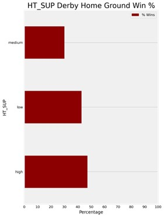

  

**FOOTBALL AND DATA SCIENCE: HOW WELL CAN THE FULL-TIME RESULT OF A FOOTBALL MATCH BE PREDICTED?**

1. **Overview**

This is a solo project and was completed in one month as part of the Data Science Immersive course at General Assembly. I was born and raised in Brazil, and following the cliché, I have lived and breathed football since I was a child. When it came the time to write my capstone project I knew it had to be something football-related and that is why this topic was chosen.

2. **Goal**

This project's scope is to use information gathered before a football match starts to predict its FULL-TIME RESULT where the possibilities could be: home team win, away team win or a draw.

A difficulty to face is that sports with low measurement scores are usually the hardest to predict. It’s like that because, for example, the “better team” (with high odds to win) could go the entire match attacking and never score, then it a draw, or, even awkward (but not rarely), the other team could score at the end of the match, and the “better team” loses.

On top of that, there are draws. Football permits the occurrence of a draw which is a problem because there are not many indicators in real life that can be used to predict it. This can be attested by checking the paying odds for draws on bet websites, they are usually the highest.

It’s a multiclassification task with no differences in weight between the classes (all classes have the same importance) hence the model will be evaluated by the accuracy score.

3. **Data**

The dataset used was found on Kaggle and contains 6840 matches from the Premier League, seasons 2000-2001 to 2017-2018, 380 matches per season. The rows are matches with information about the teams' previous results. Following are the columns found with the raw data:

  

The first few rows look like this:

  

This brings up a problem with this dataset, as it is made up of matches from a particular league, the first instances of each season are quite low on information (as can be seen above). The lack of information for the first few matches leads to the necessity to bring more information to help the model. This will be tackled when feature engineering.

**3.1. Data Cleaning**

Not much had to be done when it comes to data cleaning as the dataset was almost spotless. Still, what was done:

1- dropped column ‘Unnamed: 0’; and

2- team's names were changed to lower case and separated by "_" rather than " ". Also, 'Man City', 'Man United' and 'qpr' with the full name.

**3.2. Data Engineering**

Initially, the full-time result column (‘FTR’) was split into two classes: ‘H’ (home team wins) and ‘NH’ (away team wins or a draw). But, for my project, I wanted to be more specific and try to predict the exactly three possible outcomes (home team wins, away team wins or a draw), then this column was changed to: 'H' for home team win, 'D' for a draw and 'A' for away team win.

After that, I applied daytime on the column ‘Date’ and used those values to create a new column ‘Season’ with the format I wanted (i.e.: ‘2001-2002’, ‘2002-2003’).

I realised that the columns 'HTP', 'ATP', 'DiffFormPts', ’DiffPts', 'HTGD', 'ATGD' came with weird values (they were probably standardized previously). As I wasn't who did the standardization, I couldn’t trust those inputs. I didn’t want to bring this information from outside the dataset thus I made some feature engineering to get all the values.

**3.3. New Data**

In the first section of this topic, it was introduced the problem of the lack of information for the first matches of every season. To help with that, I was able to come up with some new features (from outside the dataset) that later I could see had a huge impact on predictions.

**3.3.1. Last Season Points**

First, I made a simple feature engineering to create two new columns ‘HTLSP’ and ‘ATLSP’ (‘home team last season points’ and ‘away team last season points’), pretty straightforward, the number of points achieved by each team on the previous season (if the team did not participate, then it’s filled with 0).

The team that achieved higher points should have the lead. It’s one more indicator to help predictions.

**3.3.2. Derby**

A football “derby” is a match between two teams with a long-standing rivalry. It’s well known that a derby is a match with much passion involved and this could affect predictions.

I created a derby dictionary with one team as the key and the other as the value, after that, I iterated through the HomeTeam and AwayTeam columns to create a column 'Derby' ("1" for derby and "0" for not derby), in the EDA I could see how this changes the behaviour of winning rates.

**3.3.3. Supporters**

That’s probably the highlight of the project. I thought that it could help predictions if some information about the team's fans were filled in the table.

The first problem to pull this off is: how to find how many fans a given team had in 2000?

The solution I came up with is that, instead of using the exact number, I could build a classification and split the teams into ‘high’, ‘medium’ or ‘low’ support, because the balance of this class doesn't change that much throughout the years. In this context, for example, a team with high support in 2000 still is a high support team in 2018.

Nevertheless, I still had to find some numbers to base the classes and to do that I use the number of Instagram followers that each team has today. Again, despite social media was not a thing back in the early 2000s, the balance of this class doesn't change (at least not in that small span of 20 years). 

As there are not many unique teams, I manually build a dictionary with names and values. Coding a scrapper just to do that seems overkill.

After assessing the information gathered, I've decided to give the following classification: LOW, up to 1 million followers; MEDIUM, 1 to 15 million followers; and HIGH, for everything above 15 million followers.

Also, in the UK the number of supporters apparently is positively correlated to how wealthy a team is. A rich team might have a better squad. This classification should help to reflect that as well (I don't have the monetary value of each squad to put this hypothesis into proof, but, with the knowledge I have about football, that seems to be the case).

Running some tests on the modelling part, I noticed that when I don’t use this feature the score drops around 2 points, which I think it’s quite a big impact.

In the end, the new features look like this on the dataset:

  

4. **EDA**

I used the EDA mostly to explore how is the relationship between the new variables created by me and if those make sense.

First, I tackle the assumption that teams with high supporters have more expensive and better squads if so, their winning rates should be better. Let’s see:

  
  

  
  

Not surprisingly, high supporter teams have a better rate in every single stat, they win more and lose less when playing at both home or away ground.

Now I took some time to check how the occurrence of a derby changes the winning rates. That’s the distribution of winning rate at home ground when it’s not a derby (it’s grouped by supporters):

    

And that’s what happens when it’s a derby:

    

As suspected, a massive drop from almost 70% to 50% on the high supporter level as well as a drop was seen on the medium level. 

It's worth noting that, as said, the dataset is divided by matches so the home and away team changes from one row to another and, with that, the information is carried along, because of that it’s basically useless to look for a relationship between the features using the matrix correlation for example. 

    

This could be seen as well when I did try to have some insights from pandas describe:

    

Nothing pops out exactly because the values are carried out from row to row and home team stats to away team stats when the match changes.

5. **Modelling**

To start the modelling part, first, it's imperative to set the baseline. In this specific case, the classes are distributed as follows:

    

The EDA shows the difficulty to find correlations between the variables, so the way I found to get around this was to run different models with a different set of features and evaluate how the scores change.

I choose to use LogisticRegression to find the best features. The first run dropping just the columns 'Season', 'Date', 'MW', 'FTR', 'FTHG', 'FTAG' (leaving on the team's names) was barely above the baseline:

    

    

Many attempts later, I found that just a few features manage to carry all the relevant information. Using only the difference in points between the teams; the difference in goals scored vs goals conceded; the last season's points; the difference in points of the last 5 matches; derby; supporters I was able to achieve great results:

    

    

After finding the best set of features, I used different algorithms to try to increase the accuracy score but was quite surprised that most of them maintain the score basically the same.

Even though the difference was really small, I choose the best between them (LogisticRegression and RandomForest) to run a gridsearchCV and try to improve a bit more.

The final results are:

LogisticRegression:

    

RandomForest:

    

Even with a massive gridsearchCV for both LogisticRegression and RandomForest, the numbers didn’t improve that much with a best accuracy score sitting at 0.54.

6. **Conclusion**

After assessing the data with many different models, parameters and features I've concluded that getting a good f1-score for a draw is probably impossible. Most models don't even predict draws at all, and those who do, get in general poor precision and f1-scores. 

Regarding the accuracy in general, the highest number was 0.54 which I think it's very good in comparison with the baseline rate. Bear in mind how hard it's to predict football matches, there wasn't information about players and the table only contains data for a specific league.

7. **Next Steps**

First of all, decide whether or not is useful to try to predict draws. Regarding the data, information about the players it's imperative (their attributes and how are they performing over the season). More precise team stats (shots, tackles, etc). How important is the outcome of that particular match. It could be given to the column 'former points' some kind of weight based on the last teams faced by home or away team, it should help this information to be more useful. A model that uses daytime as a predictor also is a good idea to be tried.

8. **Key Learnings & Challenges**

I can easily point out two major learnings after this project:

1- work with python language: on the course, sometimes I felt that I wanted to do something and simply did not know how to do it in python, now, with the tools that I've learned, I feel that I’m capable of making python do anything for me. On purpose, I “create” challenges throughout the project, some feature engineering that could be done in ways a little easier, aiming to increase this skill. After all the hard work, this even sparks an interest in going deeper and studying more software engineering-related matters.

2- evaluate a classification model: working with a multiclassification problem made me understand better the concepts of precision, recall, f1-score and accuracy.

Those were, indeed, the biggest challenges that I had before the project and going through all the work to overcome them, gave me some great experience in how to deal with these problems.

9. **Libraries Used**
* Pandas
* NumPy
* Scikit-learn
* Matplotlib
* Seaborn
